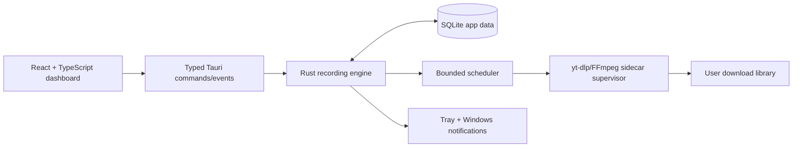

# Live Downloader — Tauri Migration Plan

> Status: **In progress**  
> Started: 2026-07-09  
> Target: Windows 10/11 x64 Tauri 2 desktop application

## Product objective

Replace the PowerShell/WinForms live-stream watcher with a reliable native Windows
application that monitors authorised stream URLs and records them with a managed
`yt-dlp`/FFmpeg sidecar. The application must remain useful while its window is
closed: the recording engine, tray controls, optional Windows startup, and native
notifications stay available in the background.

## Legacy baseline

The current repository contains:

- `LiveDownloader.App.ps1`: a WinForms screen that edits `config.json`, starts a
  hidden worker, and polls `status.json` every five seconds.
- `LiveDownloader.ps1`: a sequential polling loop. It runs `yt-dlp --simulate`
  per URL and starts a detached `yt-dlp` process when a stream is live.
- PowerShell startup/stop scripts and a Task Scheduler task.

### Findings from the legacy review

1. Probes run sequentially and block the global loop; a slow provider delays every
   other target.
2. `config.json` and `status.json` are shared mutable state, so they can become
   stale or be read while partially written.
3. UI and stop scripts discover processes by matching command lines, which cannot
   reliably distinguish application-owned `yt-dlp` processes from other instances.
4. Probe logs grow without retention and the worker removes broad `_MEI*` temp
   directories outside the application boundary.
5. Data paths default to the repository directory, which is inappropriate for an
   installed application.

## Chosen architecture

### Core technical decisions

- Tauri 2 hosts a React + TypeScript + Vite frontend.
- Rust owns all scheduling, persistence, process spawning, cancellation, and
  filesystem validation. The frontend receives no generic shell access.
- SQLite is the source of truth for targets, jobs, settings, and history. SQLite
  runs in WAL mode with migrations and a short busy timeout.
- Tokio tasks use bounded probe and recording semaphores, task cancellation tokens,
  explicit timeouts, and a coalesced UI event stream.
- The bundled `yt-dlp`/FFmpeg sidecar is preferred; an external binary is an
  advanced fallback retained for legacy migration.
- The initial scale target is 500 monitored sources with bounded concurrency, not
  unbounded simultaneous recordings.

## Visual specification

The primary dashboard concept was generated before UI implementation:

- Concept path: `C:\Users\daviblro\.codex\generated_images\019f488e-a69f-7650-b7bf-03c0b1c40ae2\exec-c9e76e5c-3f70-4e44-ba41-04abe5066d40.png`
- Direction: dark ink-blue desktop shell; narrow navigation rail; table-first
  watch list; selected recording inspector; blue actions; amber recording state;
  low-to-medium density; concise toolbar; no marketing wrapper.
- Design tokens: `#07131c` background, `#0d1c27` surface, `#1f7aff` primary,
  `#f6a71a` recording, `#55c959` healthy, 14px radius, 8px spacing scale,
  Inter/Segoe UI typography, 1.5px outline icons.

The implementation must preserve this table-first layout in dark mode and derive
the light mode from the same semantic tokens. App controls and text remain native
HTML/React, not rasterised in the generated concept.

## UX scope

- Overview dashboard with engine health, active recordings, disk space, and the
  next global check.
- Watch list with add, validate, edit, remove, pause/resume, filter, and immediate
  check actions.
- Persistent history of recordings and failed attempts with file/folder actions.
- Settings for theme, downloads, start with Windows, launch-to-tray, monitoring
  limits, sidecar behaviour, log retention, and notifications.
- Tray menu: show dashboard, pause/resume all, open downloads, and quit.
- Close-to-tray behaviour while the engine is running; explicit exit stops active
  work safely.

## Data migration

On first launch, the app searches the legacy repository configuration only when a
user invokes import or launches from the legacy folder. Import is idempotent and
creates a backup before writing the database.

| Legacy config value | New persistent value |
| --- | --- |
| `Streams` | enabled rows in `watch_targets` |
| `YtDlpPath` | optional sidecar override |
| `CheckIntervalSeconds` | default probe interval setting |
| `DownloadDirectory` | configured download library |
| `LogDirectory` | retained only as a legacy log reference |

The import must never delete the PowerShell installation or stop a legacy task
without confirmation. A migration marker prevents duplicate imports.

## Implementation phases

| Phase | Status | Deliverable |
| --- | --- | --- |
| 0. Architecture and design | Complete | Architecture, persisted plan, visual spec, tooling validation |
| 1. Tauri foundation | Complete | Vite frontend, Rust shell, typed IPC, strict capabilities |
| 2. Persistence and migration | Complete | SQLite schema, settings, legacy import, history |
| 3. Recording engine | Complete | Scheduler, sidecar supervisor, state events, cancellation |
| 4. Product UX | Complete | Dashboard, watch list, history, settings, responsive themes |
| 5. Windows integration | Complete | Tray, autostart, notifications, single instance |
| 6. Packaging and release | Complete | NSIS installer config, sidecar, icon, release documentation |
| 7. Verification | Complete with release prerequisites | Unit/integration/UI/installer validation and findings |

## Security and reliability rules

- Validate HTTP(S) URLs and canonicalised user-selected paths in Rust.
- Construct sidecar arguments in Rust; do not permit raw shell execution from the
  frontend.
- Persist no provider cookies or access tokens in SQLite/logs.
- Rotate structured logs and redact sensitive URL query strings.
- Use graceful cancellation followed by a bounded forced kill, always tracking
  children by the process handles created by the supervisor.
- Test low-disk, sidecar failure, provider timeout, app restart, and legacy-worker
  coexistence before release.

## Progress log

### 2026-07-09 — Initial architecture and UI concept

- Completed legacy code review and documented migration constraints.
- Read the Tauri v2, tray, sidecar, capabilities, Windows installer, React, and
  frontend QA guidance before implementation.
- Generated a design reference for the primary dashboard. It will be used for
  visual QA after the application can run.
- No legacy files have been modified or removed.

### 2026-07-09 — Foundation implementation

- Added the React/Vite application, TypeScript contracts, responsive dashboard,
  watch-list controls, history, settings, legacy import affordance, and a browser
  preview dataset. The preview is deliberately not the production source of truth;
  Tauri replaces it with Rust IPC data at runtime.
- Added a Rust Tauri library with SQLite WAL persistence, typed commands, legacy
  configuration import, a bounded background scheduler, timeouts, job cancellation,
  process ownership, and engine change events.
- Added a Tauri capability file that grants only core window/event functionality,
  autostart state changes, and opener actions. The dashboard does not receive a
  generic shell or filesystem permission.
- Added a close-to-tray lifecycle, one-instance handling, and a dynamic tray menu.
- Added the first per-user NSIS configuration and hooks. The installer preserves
  recordings during uninstallation.

### 2026-07-09 — Tooling findings

- This repository did not contain a JavaScript package manager configuration. The
  workspace pnpm policy initially blocked esbuild's trusted postinstall binary.
  `pnpm-workspace.yaml` now explicitly permits esbuild, allowing the Vite toolchain
  to run without a global permission change.
- The first Rust build downloads the full Tauri/Windows toolchain and is in progress.
- The existing `C:\ffmpeg\yt-dlp_x86.exe` is present, but FFmpeg is not at
  `C:\ffmpeg\ffmpeg.exe`. The release implementation will bundle the compatible
  existing yt-dlp executable and document FFmpeg as an optional capability until a
  redistributable FFmpeg build is selected and its license notice is added.

### 2026-07-09 — Final implementation and validation

- Added native notification support. It requests the operating-system permission
  only when notifications are enabled and a background engine event increases the
  active recording count.
- Added unit coverage for URL validation and the SQLite settings/target/job
  lifecycle. `cargo test --manifest-path src-tauri/Cargo.toml` passes with two
  tests across the library, binary, and doc-test suites.
- `cargo check --manifest-path src-tauri/Cargo.toml` and `pnpm build` pass after
  formatting. `git diff --check` reports no whitespace errors.
- Browser QA used the local Vite preview. The page identity was `Live Downloader`,
  the DOM contained the dashboard rather than an empty shell, and the console had
  no warnings/errors. The tested interaction path was: dashboard → Add stream →
  submit a valid Twitch URL → watch-list count becomes 7 and the new source becomes
  selected; then Pause all → header changes to `Monitoring is paused` and the
  Resume control appears.
- Responsive QA at 390×844 preserved the dashboard heading, Add stream action,
  active source rail, watch table, and mobile view switch without overflow.
- Visual comparison against the generated dashboard concept confirmed the intended
  dark ink-blue palette, narrow navigation rail, recording rail, table-first main
  surface, selected source inspector, blue primary action, and amber recording
  status. Intentional deviations: generated avatar imagery was replaced with
  deterministic initials (no provider avatars are fetched), and the product uses a
  real legacy-import callout instead of a decorative header control.
- Generated and committed the Windows icon source and platform icon variants.
- Built the exact final NSIS configuration successfully. Installer artifact:
  `src-tauri/target/release/bundle/nsis/Live Downloader_0.1.0_x64-setup.exe`
  (17,792,096 bytes at final build time). The bundled sidecar executed successfully and
  reported `yt-dlp 2026.06.09`.
- Adjusted startup persistence so Windows autostart registration completes before
  the user preference is stored; a registration failure cannot leave a misleading
  enabled setting behind. Rebuilt the final NSIS artifact after this adjustment.

## Remaining release prerequisites

The implementation is complete; the following items require product-owner secrets
or a third-party distribution decision rather than further application code:

1. Obtain and configure a Windows code-signing certificate plus timestamp service.
2. Run the signed installer on a clean Windows VM before broad distribution. The
   application delivers manual updates through GitHub Releases rather than an
   in-place Tauri updater.
3. Complete the product-owner/legal review of the bundled GPL v3 FFmpeg essentials
   build and its distribution obligations before public release. The required
   notices and upstream build reference are bundled, but this plan is not legal
   advice.
4. Perform one authorised provider-recording smoke test on a clean machine. No
   real provider recording was started during implementation or QA.

### 2026-07-10 — FFmpeg out-of-box packaging

- Inspected the user-provided `ffmpeg` folder and verified FFmpeg/FFprobe execute
  successfully. The selected source is the Gyan.dev 64-bit static essentials build
  `2026-06-08-git-6028720d70`, licensed under GPL v3.
- Packaging now includes only `ffmpeg.exe`, `ffprobe.exe`, and their GPL/source
  notices. It intentionally excludes `ffplay.exe`, the documentation, presets, and
  duplicate legacy yt-dlp binaries.
- The recording engine supplies the deployed Tauri sidecar directory to yt-dlp via
  `--ffmpeg-location`; end users do not need FFmpeg on PATH.
- Re-ran unit tests, `cargo check`, frontend production build, and whitespace
  validation after the integration. The Rust test suite now includes coverage for
  resolving the deployed sidecar directory from normal and Cargo `deps` paths.
- Built the NSIS installer successfully. The resulting
  `src-tauri/target/release/bundle/nsis/Live Downloader_0.1.0_x64-setup.exe` is
  71,917,092 bytes (2026-07-10 00:37 local time).
- Inspected the completed NSIS archive. It contains `live-downloader.exe`,
  `yt-dlp.exe`, `ffmpeg.exe` (101,774,336 bytes), `ffprobe.exe` (101,568,000
  bytes), and the bundled FFmpeg GPL/source notices. This confirms a fresh user
  installation receives all required executables without a separate FFmpeg or
  yt-dlp installation.

### 2026-07-10 — GitHub release delivery and v1.0.0 preparation

- Aligned the frontend package, Rust package, and Tauri bundle at version `1.0.0`.
  The local NSIS build produced
  `src-tauri/target/release/bundle/nsis/Live Downloader_1.0.0_x64-setup.exe`
  (71,911,578 bytes) and archive inspection reconfirmed the yt-dlp, FFmpeg, and
  FFprobe payloads plus the FFmpeg GPL/source resources.
- Added a read-only GitHub Releases availability check. The installed app compares
  its own version with the latest stable release and shows a dismissible dashboard
  notice that opens the matching GitHub Release in the user’s default browser. It
  does not download, install, or trust an in-place updater.
- Added Windows-only validation and tag-driven publishing workflows. Pull requests
  and pushes to `main` build/test the app and retain an installer artifact; `v*`
  tags build an installer on a clean Windows runner and attach it to the GitHub
  Release.
